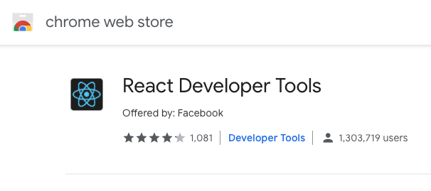

export { default as theme } from './theme'
import { Appear, Head, Image } from 'mdx-deck'
import { FullScreenCode, Split } from 'mdx-deck/layouts'

<Head>
  <title>Profiling React - Jose Santos</title>
</Head>

# Profiling React ⚛🔥
How to make your app not just fast, but blazingly fast!
---
<h1>What does profiling mean? 🤔</h1>
<Appear>
  <h2>📊📈📉📋🧐</h2>
</Appear>
---
# Where do I start? 🤷‍♀️
---
<h2>Profiling is only supported on   `react-dom 16.5+` (on dev mode).</h2>
<Appear>
  <h3>Psttt ... now you can start upgrading</h3>
  
I'll wait ...

  <h2>Go!</h2>
</Appear>
---
export default Split

### Install "React Dev Tools" in your browser

---
# How do I even use this?! 🙃
---
<Image src="./images/react-tab-dev-tools.png" size="597px 207px"/>
---
<Image src="./images/flame-graph.png" size="800px 178px"/>
---
<Image src="./images/ranked-graph.png" size="978px 202px"/>
---
# DEMO TIME ⏰
---
# THANKS! ❤️
---
Slides and code are available at:

[https://github.com/JMSantos94/profiling-react-presentation](https://github.com/JMSantos94/profiling-react-presentation)
